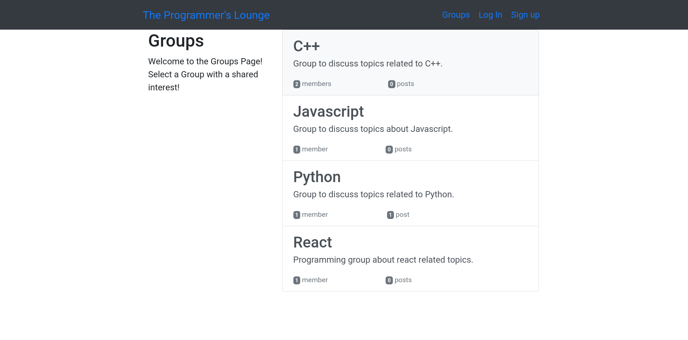

# Smartbrain-App

## :book: Description

Front-End application for Multiple Face Detection created with Create React App.

Social network where you can read and share posts in different groups.

### :dart: Features

- MPA created with Django
- Styled with Bootstrap 4
- SQLite DB

### :high_brightness: Visuals



## :bulb: Getting Started

Follow the instructions below to get a copy of the project, whether it's for development or testing purposes.
3
### :clipboard: Prerequisites

You'll need Git, Python 3.7, Pip, Django and a Virtual Environment (like Conda).

```
node@v12.13.0 or higher
npm@6.13.1 or higher
git@2.17.1 or higher
```

### :computer: Installation

```
# Clone this repository
$ git clone https://github.com/miguel-osuna/Simple-Social-App.git

# Go into the repository from the terminal
$ cd Simple-Social-App

# Remove current origin repository
$ git remote remove origin
```


All dependencies are listed on the requirements.txt file. 

Install all project dependencies. 

```
# Create a virtual environment on the project root directory
$ conda create --name simplesocial_env python=3.7

# Install the project dependencies
$ pip install -r requirements.txt

# Run migrations for the project
$ python manage.py makemigrations
$ python manage.py migrate

# Run the app
$ python manage.py runserver
```

## :rocket: Deployment

Once you are ready to deploy your project, read the [following tutorial](https://djangostars.com/blog/top-django-compatible-hosting-services/) to choose your hosting

## :wrench: Built With

- [Django](https://www.djangoproject.com/) - Python Web Framework 
- [Heroku](https://heroku.com/) - Hosting Platform

## :performing_arts: Authors

- **Miguel Osuna** - https://github.com/miguel-osuna

## :ledger: License

This project is licensed under the MIT License - see the LICENSE.md file for details.
